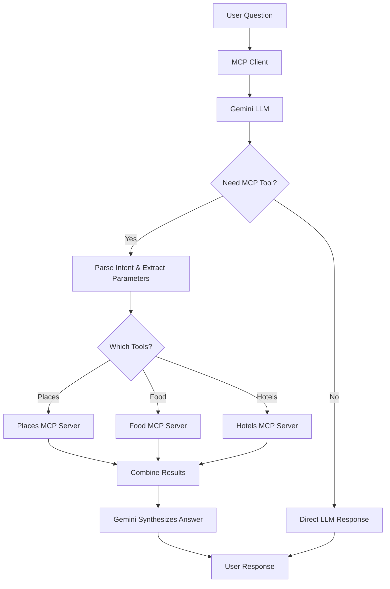

# 🌍 Travel MCP Chatbot

<div align="center">


**A smart conversational travel assistant powered by Google Gemini and Model Context Protocol (MCP)**

[Features](#-features) • [Quick Start](#-quick-start) • [Architecture](#-architecture) • [Usage](#-usage) • [Contributing](#-contributing)

</div>

---

## 📖 Overview

The Travel MCP Chatbot is an intelligent travel assistant that leverages **Google Gemini 2.5** and **FastMCP** to provide personalized travel recommendations. Unlike traditional chatbots with hardcoded responses, this system dynamically decides whether to answer from the LLM's knowledge or call specialized MCP tools.

### 🎯 What Makes It Special?

- 🧠 **Smart Routing**: Automatically determines when to use LLM vs MCP tools
- 💬 **Conversational Memory**: Remembers context across the conversation
- 🎨 **Natural Language**: No rigid commands - just chat naturally
- 🔧 **Modular Design**: Easily extend with new MCP servers
- 🚀 **Zero Hardcoding**: All intelligence comes from Gemini

---

## ✨ Features

| Feature | Description |
|---------|-------------|
| 🏛️ **Places** | Discover top tourist attractions and landmarks |
| 🍜 **Food** | Get recommendations for local cuisine and must-try dishes |
| 🏨 **Hotels** | Find accommodations based on budget preferences |
| 🧠 **Context Memory** | Remembers your destination across questions |
| 💰 **Budget Aware** | Automatically extracts and remembers budget preferences |
| 🔄 **Follow-ups** | Natural conversation flow with context switching |
| ⚡ **Real-time** | Live MCP tool calls with visual feedback |

---

## 🏗️ Architecture



### 🔄 How It Works

1. **User asks a question** → Natural language input
2. **Gemini analyzes intent** → Determines which tools are needed
3. **Parameters extracted** → City, budget, preferences
4. **MCP tools called** → Only relevant servers contacted
5. **Results synthesized** → Gemini creates cohesive response
6. **Context updated** → Remembers for follow-up questions

---

## 📁 Project Structure

```
travel-mcp-chatbot/
│
├── 📂 client/
│   ├── mcp_client.py              # Original client
│   └── mcp_chatbot_enhanced.py    # ✨ Enhanced chatbot with memory
│
├── 📂 servers/
│   ├── food_server.py             # 🍜 Food recommendations MCP server
│   ├── hotels_server.py           # 🏨 Hotel suggestions MCP server
│   └── places_server.py           # 🏛️ Tourist places MCP server
│
├── 📂 docs/
│   ├── ENHANCEMENTS.md            # Detailed enhancement guide
│   └── examples.md                # Usage examples
│
├── 🔒 .env                        # API keys (not in git)
├── ⚙️ mcp.json                    # MCP server configuration
├── 📦 requirements.txt            # Python dependencies
├── 🧪 test_gemini.py             # Gemini API test
└── 📖 README.md                   # You are here!
```

---

## 🚀 Quick Start

### Prerequisites

- Python 3.10 or higher
- Google Gemini API key ([Get one here](https://aistudio.google.com/app/apikey))

### 1️⃣ Clone Repository

```bash
git clone https://github.com/your-username/travel-mcp-chatbot.git
cd travel-mcp-chatbot
```

### 2️⃣ Set Up Environment

```bash
# Create virtual environment
python -m venv venv

# Activate virtual environment
# Windows:
venv\Scripts\activate
# Mac/Linux:
source venv/bin/activate

# Install dependencies
pip install -r requirements.txt
```

### 3️⃣ Configure API Key

Create a `.env` file in the root directory:

```env
GOOGLE_API_KEY=your_gemini_api_key_here
```

> ⚠️ **Security Note**: Never commit your `.env` file to version control!

### 4️⃣ Configure MCP Servers

Ensure `mcp.json` is set up correctly:

```json
{
  "client": {
    "model": "gemini-2.5-flash"
  },
  "servers": [
    {
      "name": "tour-places",
      "url": "http://127.0.0.1:8001/mcp",
      "tools": ["top_places_to_visit"]
    },
    {
      "name": "tour-food",
      "url": "http://127.0.0.1:8002/mcp",
      "tools": ["top_food_to_try"]
    },
    {
      "name": "tour-hotels",
      "url": "http://127.0.0.1:8003/mcp",
      "tools": ["top_hotels_to_stay"]
    }
  ]
}
```

### 5️⃣ Start MCP Servers

Open **three separate terminals** and run:

```bash
# Terminal 1 - Places Server
fastmcp run servers/places_server.py:mcp --transport http --port 8001

# Terminal 2 - Food Server
fastmcp run servers/food_server.py:mcp --transport http --port 8002

# Terminal 3 - Hotels Server
fastmcp run servers/hotels_server.py:mcp --transport http --port 8003
```

### 6️⃣ Launch Chatbot

```bash
# In a new terminal
cd client
python mcp_chatbot_enhanced.py
```

---

## 💬 Usage Examples

### 🎬 Example 1: Single Topic Query

```
You: What are the top places to visit in Paris?

🔍 Looking up top_places_to_visit for Paris...

🤖 Here are the must-visit places in Paris:

• Eiffel Tower - The iconic iron tower offering stunning city views
• Louvre Museum - World's largest art museum, home to Mona Lisa
• Notre-Dame Cathedral - Gothic masterpiece (currently under restoration)
• Arc de Triomphe - Monument honoring French military victories
• Sacré-Cœur - Beautiful basilica in Montmartre
• Champs-Élysées - Famous avenue for shopping and dining

Would you like recommendations for food or hotels as well?
```

### 🔄 Example 2: Conversational Follow-ups

```
You: Tell me about Tokyo

🔍 Looking up top_places_to_visit for Tokyo...

🤖 [Tokyo attractions listed...]

You: What should I eat there?

🔍 Looking up top_food_to_try for Tokyo...

🤖 Here are must-try foods in Tokyo:

• Sushi - Fresh from Tsukiji Outer Market
• Ramen - Try Ichiran or local ramen-ya
• Tempura - Light, crispy perfection
• Tonkatsu - Breaded pork cutlet
...

You: Budget hotels please

🔍 Looking up top_hotels_to_stay for Tokyo...

🤖 Great budget options in Tokyo:

Shinjuku Area:
• Capsule Inn - Unique Japanese experience
• Kimi Ryokan - Traditional budget accommodation
...
```

### 🎯 Example 3: Comprehensive Query

```
You: I'm planning a trip to Barcelona - what should I see, eat, and where should I stay on a midrange budget?

🔍 Looking up top_places_to_visit, top_food_to_try, top_hotels_to_stay for Barcelona...

🤖 Here's your complete Barcelona guide:

📍 Top Places to Visit:
• La Sagrada Familia
• Park Güell
• Las Ramblas
...

🍽️ Must-Try Foods:
• Paella
• Tapas
• Crema Catalana
...

🏨 Midrange Hotels:
Gothic Quarter:
• Hotel Barcelona Cathedral
...
```

### 🔀 Example 4: Context Switching

```
You: Top attractions in Rome

🤖 [Rome attractions...]

You: Actually, let's talk about Venice instead

🔍 Looking up top_places_to_visit for Venice...

🤖 [Venice attractions...]

You: And food?

🔍 Looking up top_food_to_try for Venice...

🤖 [Venice food - still remembers Venice context]
```

---

## 🎨 Key Differences: Original vs Enhanced

<table>
<thead>
<tr>
<th>Feature</th>
<th>Original</th>
<th>Enhanced ✨</th>
</tr>
</thead>
<tbody>
<tr>
<td><b>Conversation Flow</b></td>
<td>❌ Separate input prompts</td>
<td>✅ Natural chat loop</td>
</tr>
<tr>
<td><b>Context Memory</b></td>
<td>❌ None</td>
<td>✅ Remembers city & budget</td>
</tr>
<tr>
<td><b>Follow-up Questions</b></td>
<td>❌ Must repeat city</td>
<td>✅ Natural follow-ups</td>
</tr>
<tr>
<td><b>Budget Handling</b></td>
<td>⚠️ Manual input</td>
<td>✅ Auto-extracted from text</td>
</tr>
<tr>
<td><b>Error Messages</b></td>
<td>⚠️ Basic</td>
<td>✅ User-friendly</td>
</tr>
<tr>
<td><b>Progress Feedback</b></td>
<td>❌ None</td>
<td>✅ Visual indicators</td>
</tr>
<tr>
<td><b>Multi-tool Support</b></td>
<td>✅ Yes</td>
<td>✅ Yes, improved routing</td>
</tr>
<tr>
<td><b>Conversation History</b></td>
<td>❌ No</td>
<td>✅ Last 3 exchanges</td>
</tr>
</tbody>
</table>

---

## 🧪 Testing

### Test Gemini Connection

```bash
python test_gemini.py
```

Expected output:
```
✅ Gemini API is working!
Response: [Gemini's response to test query]
```

### Test MCP Servers

```bash
# Test Places Server
curl http://127.0.0.1:8001/mcp

# Test Food Server
curl http://127.0.0.1:8002/mcp

# Test Hotels Server
curl http://127.0.0.1:8003/mcp
```

---

## 🔧 Configuration

### MCP Server Configuration

Each server in `mcp.json` requires:

- `name`: Unique server identifier
- `url`: MCP endpoint URL
- `tools`: List of available tool names

### Gemini Model Selection

Change the model in `mcp.json`:

```json
{
  "client": {
    "model": "gemini-2.5-flash"  // or "gemini-2.5-pro"
  }
}
```

### Context Window Size

Adjust conversation history in `mcp_chatbot_enhanced.py`:

```python
recent = conversation_history[-3:]  # Last 3 exchanges (adjust number)
```

---

## 🎯 How to Verify Tool vs LLM Responses

### ✅ Response from MCP Tool

**Indicators:**
- Console shows: `🔍 Looking up [tool_names] for [city]...`
- Data comes from `servers/*.py`
- Structured, factual information

**Example:**
```
🔍 Looking up top_places_to_visit for Paris...
🤖 [Detailed place list with descriptions]
```

### ✅ Response from LLM Only

**Indicators:**
- No `🔍` message in console
- Pure conversational text
- General knowledge responses

**Example:**
```
You: Thanks!
🤖 You're welcome! Have a wonderful trip! ✈️
```

---

## 🛠️ Extending the Chatbot

### Adding a New MCP Server

#### 1. Create the Server File

```python
# servers/activities_server.py
from fastmcp import FastMCP
import google.generativeai as genai

mcp = FastMCP("tour-activities")

@mcp.tool
def top_activities(city: str) -> str:
    """Get top activities and experiences in a city."""
    # Your implementation
    return response

if __name__ == "__main__":
    mcp.run()
```

#### 2. Update `mcp.json`

```json
{
  "servers": [
    {
      "name": "tour-activities",
      "url": "http://127.0.0.1:8004/mcp",
      "tools": ["top_activities"]
    }
  ]
}
```

#### 3. Update Intent Parser

In `mcp_chatbot_enhanced.py`, add tool description:

```python
Tool descriptions:
- top_places_to_visit: Returns tourist attractions and landmarks
- top_food_to_try: Returns local cuisine and food recommendations
- top_hotels_to_stay: Returns hotel and accommodation recommendations
- top_activities: Returns activities and experiences  # ← Add this
```

#### 4. Start the New Server

```bash
fastmcp run servers/activities_server.py:mcp --transport http --port 8004
```

---

## 🐛 Troubleshooting

<details>
<summary><b>❌ MCP Server Connection Failed</b></summary>

**Solution:**
1. Verify servers are running: `curl http://127.0.0.1:8001/mcp`
2. Check port numbers in `mcp.json` match server ports
3. Ensure virtual environment is activated
4. Check firewall settings
</details>

<details>
<summary><b>❌ Gemini API Error</b></summary>

**Solution:**
1. Verify API key in `.env` file
2. Check key validity at [Google AI Studio](https://aistudio.google.com)
3. Ensure no rate limits exceeded
4. Check internet connection
</details>

<details>
<summary><b>❌ JSON Parse Error</b></summary>

**Solution:**
The enhanced version handles this automatically:
```python
.replace("```json", "").replace("```", "")
```
If still occurring, check Gemini's response format.
</details>

<details>
<summary><b>❌ City Not Detected</b></summary>

**Solution:**
1. Be explicit in first message: "Tell me about Paris"
2. Check intent parser is receiving the question
3. Add more examples to the prompt
4. Bot will ask if city unclear
</details>

<details>
<summary><b>❌ Wrong Tool Called</b></summary>

**Solution:**
1. Make question more specific
2. Add examples to intent parser prompt
3. Check tool descriptions are clear
4. Review conversation context
</details>

---

## 📊 Performance Tips

- **Response Time**: MCP calls take 2-5 seconds depending on tools
- **Rate Limits**: Gemini Free tier: 15 RPM, Paid: 1000 RPM
- **Caching**: Consider implementing response caching for common queries
- **Batch Calls**: Multiple tools called in parallel when possible

---

## 🗺️ Roadmap

### Near Term
- [x] ✅ Conversation memory
- [x] ✅ Context-aware follow-ups
- [x] ✅ Budget preference extraction
- [ ] 🔄 Export conversation to file
- [ ] 🔄 Persistent context across sessions

### Medium Term
- [ ] 🌐 Real-time API integration (Google Places, TripAdvisor)
- [ ] 🖥️ Web UI (Streamlit/Gradio)
- [ ] 🗣️ Voice input/output
- [ ] 📅 Itinerary generation with dates
- [ ] 💾 User preference profiles

### Long Term
- [ ] 🧠 RAG integration with travel guides
- [ ] 🌍 Multi-language support
- [ ] 🤝 Multi-city trip planning
- [ ] 📱 Mobile app
- [ ] 🔗 Integration with booking platforms

---

## 📚 Documentation

- [Enhancements Guide](docs/ENHANCEMENTS.md) - Detailed feature explanations
- [Usage Examples](docs/examples.md) - More conversation examples
- [FastMCP Docs](https://github.com/jlowin/fastmcp) - MCP framework
- [Gemini API Docs](https://ai.google.dev/docs) - Google Gemini

---

## 🤝 Contributing

Contributions are welcome! Here's how:

1. Fork the repository
2. Create a feature branch (`git checkout -b feature/amazing-feature`)
3. Commit changes (`git commit -m 'Add amazing feature'`)
4. Push to branch (`git push origin feature/amazing-feature`)
5. Open a Pull Request

### Development Setup

```bash
# Install dev dependencies
pip install -r requirements-dev.txt

# Run tests
pytest tests/

# Format code
black .
```

---

## 📄 License

This project is licensed under the MIT License - see [LICENSE](LICENSE) file for details.

---

## 🙏 Acknowledgments

- **Google Gemini** - Powerful LLM capabilities
- **FastMCP** - Simplified MCP server implementation
- **Anthropic** - Model Context Protocol specification

---

## 👨‍💻 Author

**LAKSHAY DADHICH**

- 🔬 Data Science | AI/ML | Data Analytics
- 🧠 LLM Systems & Agent Development


---

## 💡 Inspiration

Built to demonstrate the power of combining:
- 🤖 Large Language Models (Gemini)
- 🔧 Model Context Protocol (MCP)
- 💬 Natural conversation design
- 🧠 Context-aware systems

---

<div align="center">

### ⭐ If you found this helpful, consider giving it a star!

Made with ❤️ using Python, Gemini, and FastMCP

[Back to Top ↑](#-travel-mcp-chatbot)

</div>